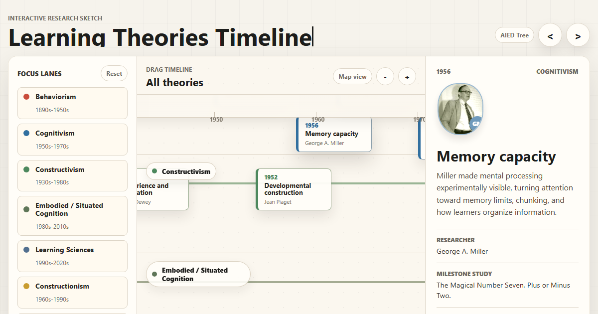

# Learning Theories Timeline

<div align="center">
  <a href="https://educatian.github.io/learning-theories-timeline/">
    
  </a>

  <p>
    An interactive research map for tracing behaviorism, cognitivism,
    constructivism, embodied and situated cognition, constructionism,
    games and immersive learning, instructional design, AECT / ISLT,
    social cognitive agency, AIED, learning analytics, EDM, LAK, QE,
    and agentic AI.
  </p>

  <p>
    <a href="https://educatian.github.io/learning-theories-timeline/"><strong>Open Live Page</strong></a>
    |
    <a href="https://github.com/Educatian/learning-theories-timeline/actions/workflows/deploy-pages.yml">Deployment Workflow</a>
  </p>

  <p>
    
    
    
    
  </p>
</div>

## Developer

Developed by **Dr. Jewoong Moon**, The University of Alabama.

Questions, corrections, or suggestions:

```text
jmoon19@ua.edu
```

## Overview

This project is a single-page interactive visualization for exploring how major learning theory traditions and adjacent research fields developed over time.

It is designed as a research sketch: dense enough to compare traditions, but visual enough to use in teaching, discussion, literature review, or early-stage curriculum design.

The app is fully static. There is no framework runtime, no build step, and no backend dependency.

## What It Covers

- Behaviorism, cognitivism, constructivism, constructionism, and social cognitive / agency traditions
- Embodied, situated, distributed, and embedded cognition
- Learning Sciences and Science of Learning milestones
- Internal motivation, flow, digital game-based learning, VR, and immersive learning
- Instructional Design models and AECT / ISLT field formation
- EGRI / EGRA as an applied teaching cycle
- AIED lineage from CAI and ITS to SCHOLAR, SOPHIE, GUIDON, cognitive tutors, Schank, AutoTutor, agents, and GenAI
- EDM, LAK / SoLAR, Epistemic Network Analysis, Learning Analytics, and Quantitative Ethnography
- Agentivism as a recent AI-era preprint and proposed theory, cross-linked with agency rather than treated as an established standalone tradition

## Interaction Model

- Drag the timeline horizontally to move across years.
- Scroll inside the timeline to move vertically across focus lanes.
- Hold `Ctrl` and use the mouse wheel to zoom the timeline map.
- Use the `+` and `-` controls for step zoom.
- Use the minimap to jump through the full historical range.
- Collapse the left focus panel, right detail panel, or both panels to enlarge the map.
- Toggle `Map view` to focus on the timeline.
- Click any milestone to open a detailed popup.
- Use previous / next controls to move chronologically.
- Expand the AIED Tree to inspect AI-in-education as a separate research lineage.

## Research And Source Notes

Milestones are intentionally short, but each item includes a source trail. Recent cleanup replaced weak or generic references with stronger sources where possible, including DOI pages, official field pages, publisher records, National Academies pages, Open Library bibliographic records, and professional society pages.

Examples of source-sensitive decisions:

- GUIDON is represented as the 1987 MIT Press book milestone rather than an unsupported 1983 entry.
- Agentivism is labeled as a preprint / proposed theory.
- Learning Sciences is treated as an interdisciplinary field formation, not as an Instructional Design lane.
- AIED is shown as a separate tree because it is a research lineage rather than a single learning theory.
- QE means Quantitative Ethnography.

## Portraits And Logos

The interface uses portrait-style researcher images where a credible public image was available. For organizations and communities such as NSF, AECT, SoLAR, EDM, and ISQE, the app uses logos or initials rather than forcing an individual headshot.

Some historical or low-visibility figures remain as initials when no reliable, stable, and directly attributable image could be verified.

## Discord Preview

The page includes Open Graph and Twitter card metadata so Discord, Slack, and social platforms can render a large preview card.

Preview image:

```text
https://educatian.github.io/learning-theories-timeline/og-image.png
```

If Discord has cached an older preview, paste the page URL with a query string:

```text
https://educatian.github.io/learning-theories-timeline/?v=2
```

## Project Files

```text
.
+-- index.html
+-- styles.css
+-- app.js
+-- og-image.png
+-- .nojekyll
+-- .github/
    +-- workflows/
        +-- deploy-pages.yml
```

## Local Use

Open `index.html` directly in a browser, or serve the folder with any static file server:

```bash
python -m http.server 9191 --bind 127.0.0.1
```

Then open:

```text
http://127.0.0.1:9191/
```

## Deployment

GitHub Pages is deployed through GitHub Actions.

The workflow publishes:

- `index.html`
- `styles.css`
- `app.js`
- `og-image.png`
- `.nojekyll`

Pushes to `main` trigger the deployment workflow automatically.
